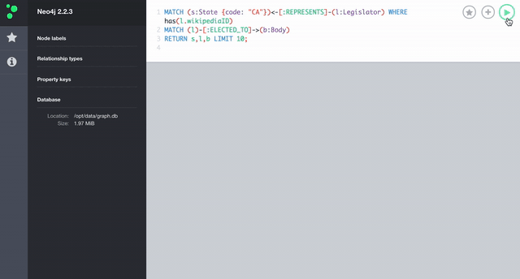

# Spark Neo4j

**Spark Neo4j** is the *fastest* way to launch or deploy a graph analytics engine for big data graph processing using the new [Docker Compose](https://docs.docker.com/compose/) framework.

This image combines **Neo4j** and **Apache Spark GraphX** containers onto a single Docker host. This approach makes it easy to take advantage of these two powerful tools without worrying about configuring and installing any other dependencies.

## Getting started

The fundamental goal of this Docker image is to get you up and running as fast as possible with a **graph analytics engine**. It should take no longer than *30 minutes* for you to launch **Spark Neo4j** on Mac OSX or Linux.

### Requirements

Get Docker:  [https://docs.docker.com/installation/](https://docs.docker.com/installation/)

## Quickstart

### Legislative Graph
A set of scripts to easily download and import US legislative data into a Neo4j database. This is a work-in-progress, please submit an issue for any errors or feature requests.

### Launch the dockers
```
docker-compose up
# Once the docker is launched, on different Terminal
docker exec -it msds-graphdb bash
/var/lib/neo4j-community-2.2.3/bin/neo4j-shell < /var/lib/neo4j-community-2.2.3/legis-graph/quickstart/114/legis_graph_import_114.cypher
```

### Launch Neo4j on browser
http://localhost:7474/browser/

### Cypher example:
```
MATCH (s:State {code: "CA"})<-[:REPRESENTS]-(l:Legislator) WHERE has(l.wikipediaID)
MATCH (l)-[:ELECTED_TO]->(b:Body)
RETURN s,l,b LIMIT 10;
```

